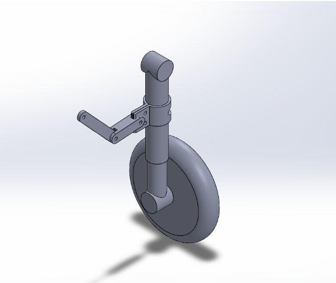
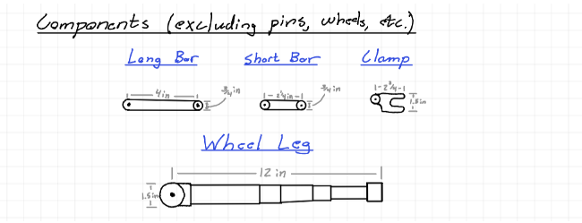
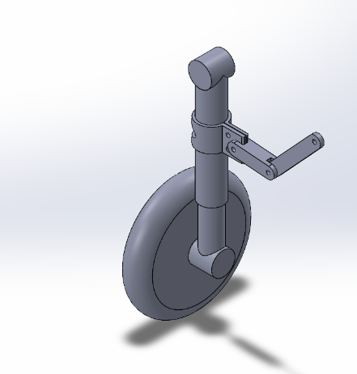
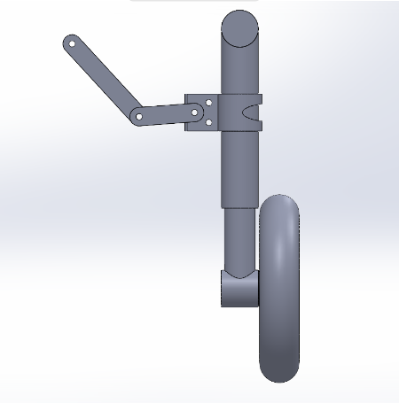
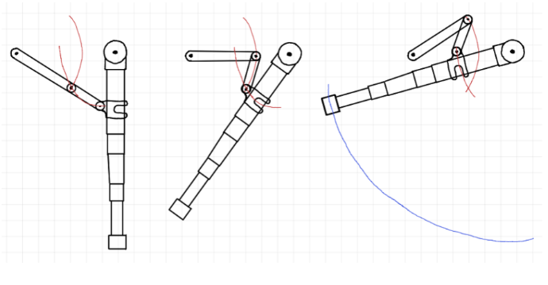
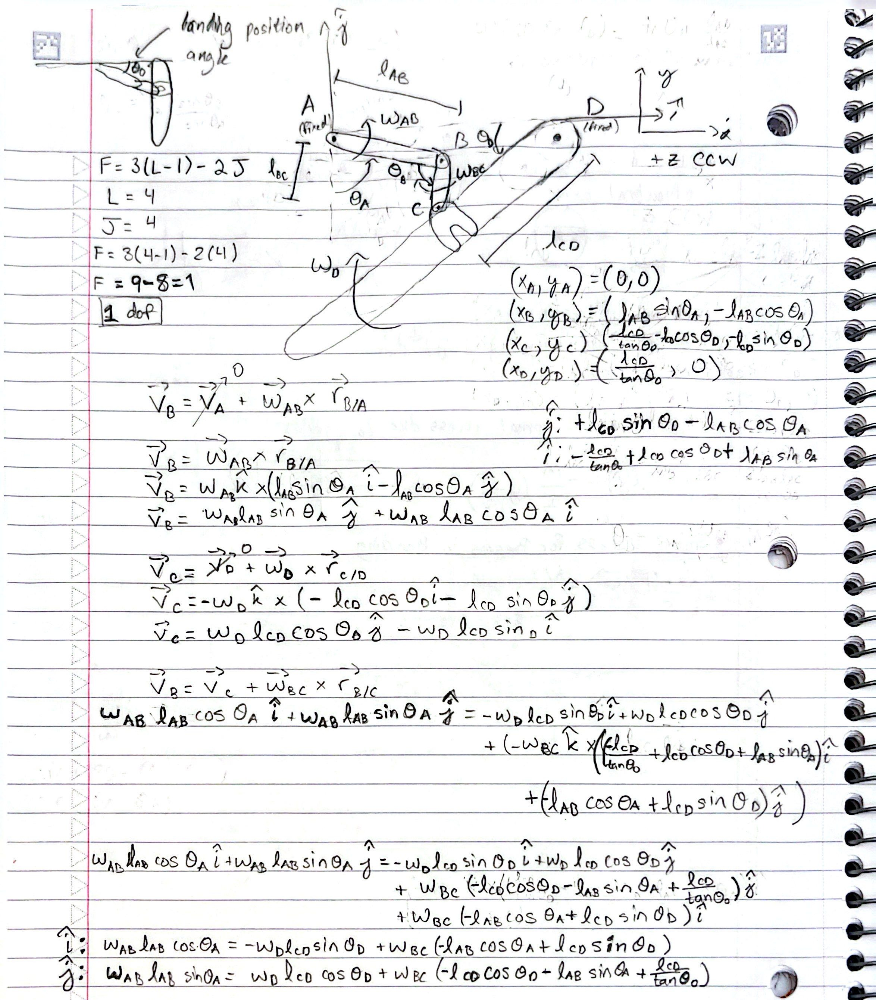
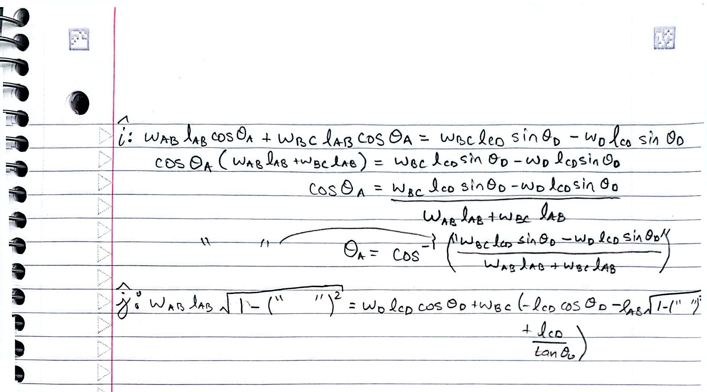

# Phase One: Project Report  
Hard Landing – Landing Gear Project  

  

Aiden Beam, Jack Bessette, Ben Kolecki, Hunter Sam, Evan Morris, Nordin Jafar  
Arizona State University  
MAE 342  

## Executive Summary

 This project aims to design and 3D print a retractable and deployable rigid-strut landing gear, intended for kinematic evaluation and preliminary structural and failure analysis. The design implicitly represents a wide-body commercial aircraft main landing gear.
Some simplifications to note are that the design replaces hydraulic actuation with a motor-powered linkage mechanism that supports and deploys the rigid strut. This allows the team to focus on the mechanical motion of the system and how loads are carried through the structure. The landing gear is analyzed at full scale using hand calculations and simulation tools such as ANSYS to evaluate stresses, motion, and potential failure modes under realistic loads.

## System Function and Decomposition
**Primary Function**

To support the aircraft during ground operations and to deploy and retract the gear during flight and landing. In the deployed position, the rigid strut and wheel assembly carry landing and taxi loads and transfer them into the aircraft structure. In the retracted position, the gear folds into the wheel well to reduce drag.
The system is designed using full-scale loads representative of a wide-body commercial aircraft.

  

<table>
  <tr>
    <td align="center">
      
    </td>
    <td align="center">
      
     </td>
  </tr>
</table>

**Decomposition**

The landing gear system is composed of a small number of rigid components connected by pin joints to allow rotation during deployment and retraction (see scaled figure).
Sketch dimensions are intended for prototype demonstration. Primary components (as shown in figure)

**Wheel Leg / Oleo**  
Main rigid strut of the landing gear.Carries the wheel assembly and primary loads  

**Long Bar**  
Part of the linkage mechanism. Controls the motion of the wheel leg during retraction and deployment.

**Short Bar**  
Works with the long bar to guide the rotation path. Helps constrain the mechanism motion.

**Clamp**  
Connects the linkage to the wheel leg. Transfers motion and loads between the linkage and main strut  

Note - Pin joints are assumed at all rotating connections but are not shown in detail. Wheels and small hardware are omitted for clarity. The simplified component layout allows the mechanism motion and load paths to be analyzed without unnecessary complexity.

## Kinematics

  

**Description**
-The landing gear mechanism is a planar linkage system composed of rigid members connected by pin joints. Based on the linkage layout, the system has one degree of freedom (1 DOF), meaning the entire motion is governed by a single input. Detailed kinematic derivations are provided in scanned notebook form
(click figures to expand)

  
  &nbsp;&nbsp;&nbsp;
  

## Preliminary Failure Mode Review

**Static overload (primarily in the main leg)**  
-Design aims to incorporate a factor of safety high enough to not fail under typical or atypical loading.

**Fatigue / cyclic loading (bearings, smaller beams)**
-Repeated extension and retraction causes wear on bearings and other load-bearing joints.  
Design aims to use materials and designs capable of handling repeated loading and to prescribe routine maintenance.

**Misalignment**  
-Tires contacting the ground at angles other than vertical may cause uneven loading.  
Design aims to incorporate components that lock the system in fully extended or retracted positions.

**Temperature-based failure**  
-In warmer environments, elevated temperatures could result in deformation or material degradation.

## Analysis Methods
**Beam Analysis**  
-Beam analysis may be applied to the primary strut to estimate stress levels and identify critical locations.

**ANSYS / Simulation Analysis**  
-The CAD assembly can be imported into ANSYS so real-world loading conditions can be applied.  
Simulation results will be used to identify and evaluate failure modes and guide design improvements.

## Critical Design Parameters
The success of the “Hard Landing” gear structure relies on the implementation of various critical design parameters. These parameters correspond to the structural integrity of the landing gear under load and ensure the mechanism operates as the kinematic relationships describe. 

**Pin to Clamp Length, ℓCD**

-The length front the pin at the top of the strut to the clamp, ℓ, is a critical parameter that directly impacts the angles that the supporting linkage bars must reach. Additionally, the location of the clamp along the oleo will determine the amount of torque the motor needs to rotate the free end with the wheel. 

**Motor Torque and Rotation Requirements**

-The hydraulics in the inspiration for “Hard Landing” have been replaced with rigid supports and rotation powered by a motor. The required torque of the stepper motor, along with the angle it must rotate to, must be calculated to bring the oleo to a 90 degree angle with the landing surface.

**Factor of Safety**

-A reasonably high factor of safety must be established after determining the highest stress components to avoid static overload and failure due to large loadings upon landing. 

**Supporting Strut Lockout**

-When the landing gear is deployed the angle between the short and long bar must be straight at 180 degrees. If this linkage is not at a straight angle, it will not effectively support the loading on the landing gear. The lengths of these bars and the pin at their linkage must be optimized to ensure they do not collapse under loading during landing. 

