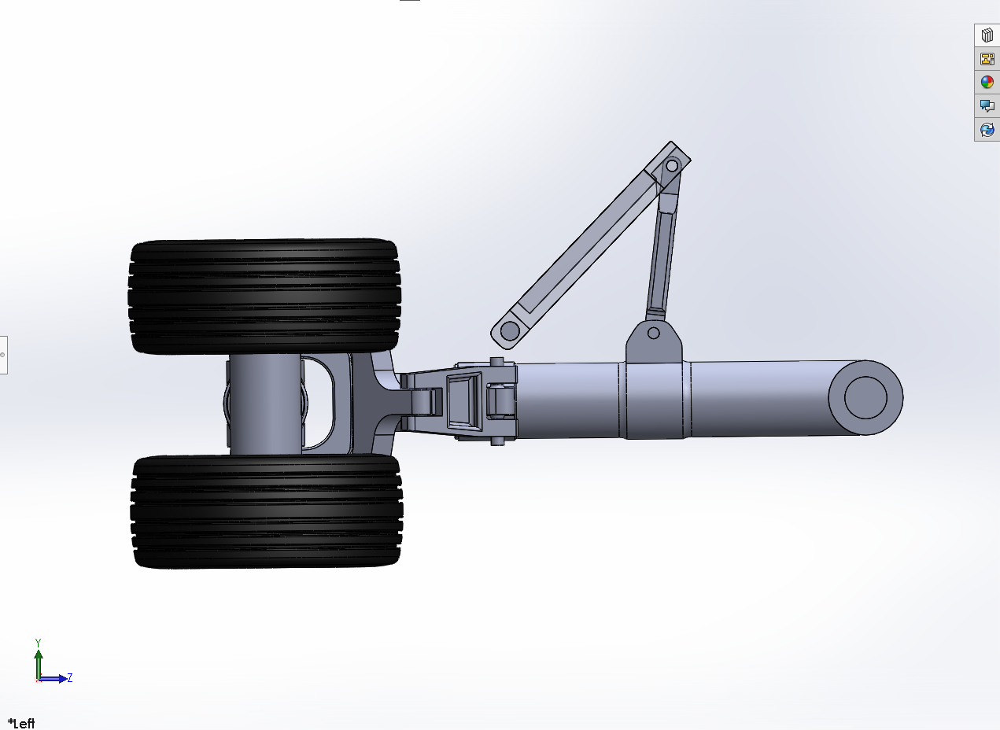
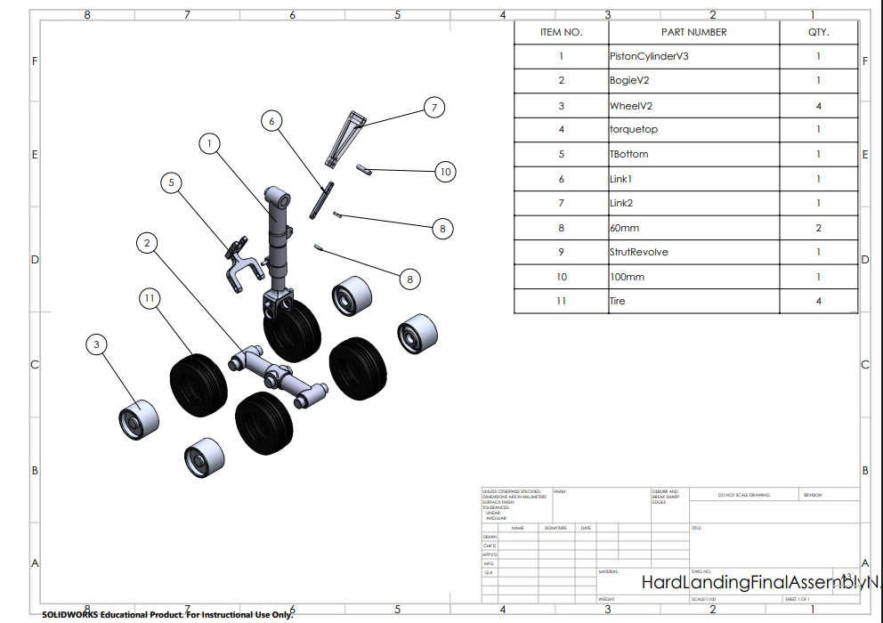
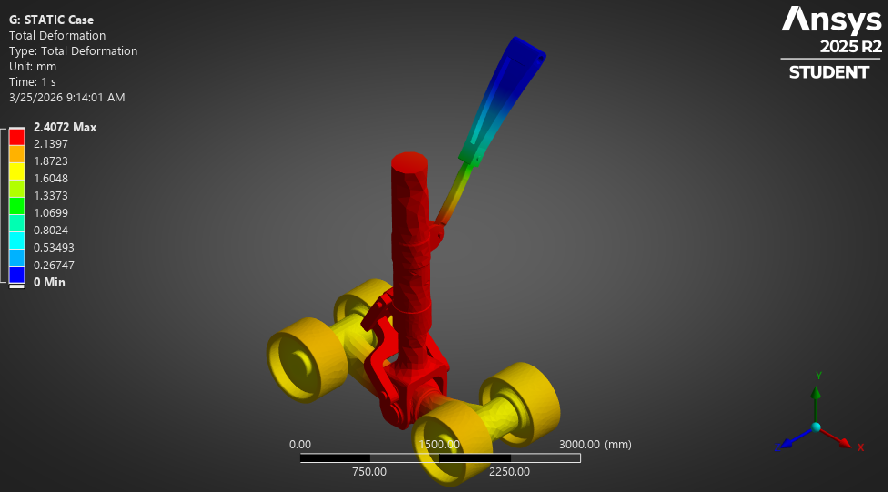
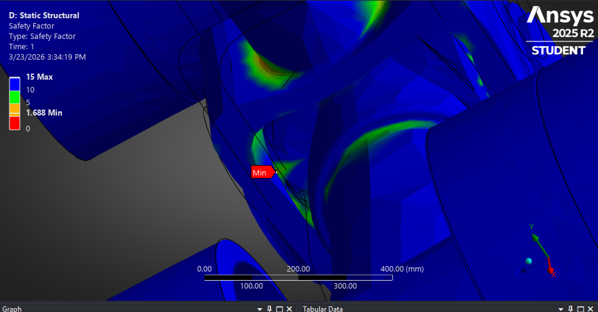
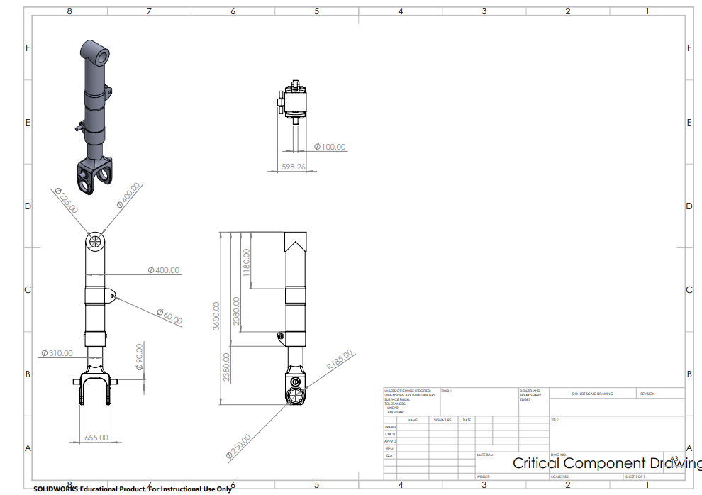

# Phase Two: Project Report  
Hard Landing – Landing Gear Project  

<table align="center">
  <tr>
    <td></td>
    <td></td>
  </tr>
  <tr>>
</table>

Aiden Beam, Jack Bessette, Ben Kolecki, Evan Morris, Nordin Jafar 

Arizona State University
  

MEE 342  
  

 
 

## **Final Design Overview**
This aircraft landing gear was modeled based off a simplified version of a large airliner landing gear. During taxi, takeoff, and landing the landing gear will be in its vertical, locked position, and during flight will retract to allow increased aerodynamic performance. Our design consists of three main sections: the strut/wheels that provide the main support for the aircraft, and the two bar linkage connected to a motor that controls the motion of the entire system.  
 

	</td>
	

 
This motor will read signals from an Arduino to rotate on its axis, extending and folding up the landing gear. These rotations will occur between two fixed-angle measurements (ensured by mechanical locks) to ensure proper positioning/orientation at all times. Both the motor itself and the top pin on the strut will be fixed to the structure of the plane wing and will not move.
 

**Printablility**  
Not including the tires, each and every CAD part in our assembly is 3D printable. We will vary the orientation of each part when printing to promote ease of printing, and also to ensure orientation of the layer lines promotes maximum strength in the direction of loading.  
 
**Landing gear deployment/retraction sequence**

Isometric View
 
	
[watch the assembly video](https://github.com/user-attachments/assets/6c1ffd8b-b0af-4d7d-89b4-459098cd728c)

 

Frontal View
 
	
[watch the assembly video](https://github.com/user-attachments/assets/f484d572-f8e7-468a-845d-adacea77aa67)

 

	</td>
	

	

  

 
	   
	  
**Full 3D Assembly**

	

  </td>

	

	

 
 

  
## **Description of Major Design Decisions and Changes from Phase 1** 
*Increased wheel count to more closely resemble inspiration*  
	-Adding three more wheels makes our model more similar to that of many commercial airliners, whose landing gear we want to replicate. This allows our calculations and simulations to be much more accurate to resemble real world conditions. Also, an even number of wheels allows for a more balanced model, so it will more easily be able to stand and hold weight without an unintended failure. (Along with this includes changes to the entire wheel base to accompany more wheels)  
 
*Improved harness connecting two-bar linkage to main strut*  
	-The updated design is able to handle stronger loads, thus resulting in a higher factor of safety of the overall assembly.

  
  
## **Detailed Explanation of Required Analyses (shaft, gear, fatigue, bearings, interfaces, etc.) with Clear Assumptions and Results**

- Discussion of design for assembly and design for 3D printing
   
 

Von-Mises Equivalent stress
<table align="center">
  <tr>
    <td></td>
    <td></td>
  </tr>
  <tr>>
</table>
 
 
Factor of Safety
	
 
 
Fatigue analysis
<table align="center">
  <tr>
    <td></td>
    <td></td>
  </tr>
  <tr>
	<td align="center"><em>Fatigue Equivalent alternating stress</em></td>
    <td align="center"><em>Fatigue Factor of safety</em></td>
  </tr>	  
</table>
 
Mesh
	(insert here)
	 
	 
Added Force

(insert here)
 
  
Total Deformation
	

	
## **Updated List of Anticipated Risks or Weaknesses to be Addressed in Prototyping**
Smallest factor of safety

 
 

## **CAD Drawings - Critical Component and Exploded View**

<table align="center">
  <tr>
    <td></td>
    <td></td>
  </tr>
  <tr>
	<td align="center"><em>Critical Component</em></td>
    <td align="center"><em>Exploded View</em></td>
  </tr>
  </table>

## **Checklist-(2 astrisks is what we have done)** 

	-full 3D assembly**
	-drawings and views (Need from Ben)**
	-printability
	-static stress and factor of safety**
	-Fatigue (Need from Aiden)
	-key/coupling/interface stresses (Need from Aiden) 
	-bearing load check**
	-global safety overview 
 
 
