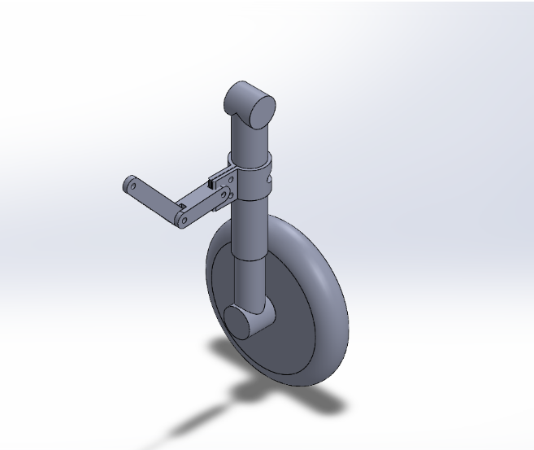

# Phase Two: Project Report  
Hard Landing – Landing Gear Project  

  

  

Aiden Beam, Jack Bessette, Ben Kolecki, Evan Morris, Nordin Jafar  
Arizona State University  
MAE 342  

Phase 2 report outline:
- Overview of your final design (with key CAD images)
  
- Description of major design decisions and changes from Phase 1
      - Increased wheel count to more closely resemble inspiration.
      - 
  
- Detailed explanation of required analyses (shaft, gear, fatigue, bearings,
interfaces, etc.) with clear assumptions and results

- Discussion of design for assembly and design for 3D printing
  
- Updated list of anticipated risks or weaknesses to be addressed in prototyping
  

CAD requirements:
- full 3D assembly
- drawings and views
- printability

required analyses:
- static stress and factor of safety
- fatigue
- key/coupling/interface stresses
- bearing load check
- global safety overview
