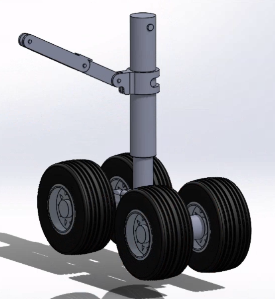
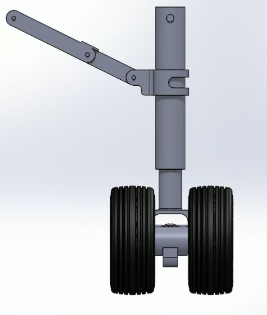

# Phase Two: Project Report  
Hard Landing – Landing Gear Project  

  

Aiden Beam, Jack Bessette, Ben Kolecki, Evan Morris, Nordin Jafar 

Arizona State University
  

MEE 342  
  

 
 
**Final Design Overview**
 
This aircraft landing gear was modeled based off a simplified version of a large airliner landing gear. During taxi, takeoff, and landing the landing gear will be in its vertical, locked position, and during flight will retract to allow increased aerodynamic performance. Our design consists of three main sections: the strut/wheels that provide the main support for the aircraft, and the two bar linkage connected to a motor that controls the motion of the entire system.  
 

  

 
This motor will read signals from an Arduino to rotate on its axis

  
**- Description of major design decisions and changes from Phase 1** 
Increased wheel count to more closely resemble inspiration  
	-Adding three more wheels makes our model more similar to that of many commercial airliners who's landing gear we want to replicate. This allows our calculations and simulations to be much more accurate to resemble real world conditions. Also, an even number of wheels allows for a more balanced model, so it will more easily be able to stand and hold weight without an unintended failure.

  
  
- Detailed explanation of required analyses (shaft, gear, fatigue, bearings,
interfaces, etc.) with clear assumptions and results

- Discussion of design for assembly and design for 3D printing
  
- Updated list of anticipated risks or weaknesses to be addressed in prototyping
  

Landing gear deployment/retraction sequence

  [watch the assembly video](https://github.com/user-attachments/assets/f703558e-a32c-4ffb-83fe-0b2da9233488)
  
  

full 3D assembly:

  [watch the assembly video](https://github.com/user-attachments/assets/a2dc4aa6-550e-4249-b24c-30bdd2203265)
    
- drawings and views
- printability

  

static stress and factor of safety
 
 
Von-Mises Equivalent stress
  

  
Factor of safety
    

	
Fatigue
  

	  
- key/coupling/interface stresses
 
bearing load check
 
 

- global safety overview
