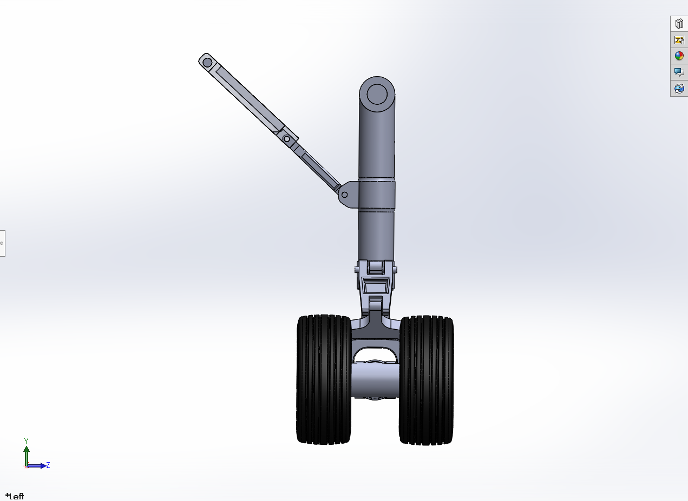
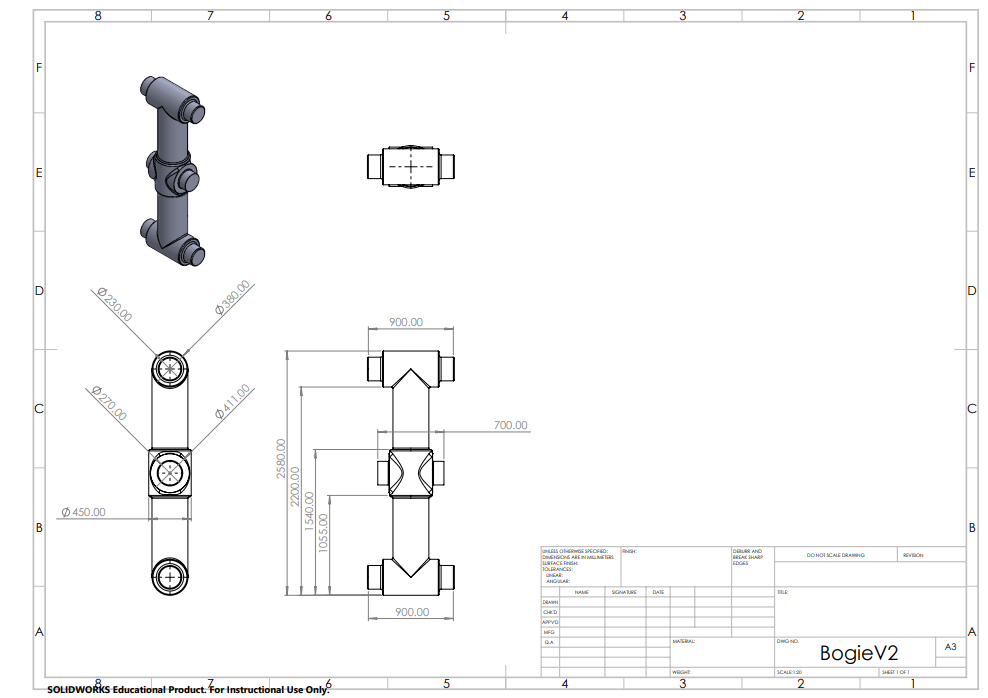

# Phase Two: Project Report  
Hard Landing – Landing Gear Project  

    </td>
  

Aiden Beam, Jack Bessette, Ben Kolecki, Evan Morris, Nordin Jafar 

Arizona State University
  

MEE 342  
  

## **Final Design Overview**
This landing gear system is designed for a wide-body commercial aircraft operating under typical taxi, takeoff, landing, and flight conditions. During ground operation, the gear remains in its vertical, locked configuration to support the aircraft, and retracts during flight to reduce aerodynamic drag.

The design is based on a representative aircraft weight consisting of structural mass and payload. For loading assumptions, 90% of the total aircraft weight was taken to be supported by the main landing gear, with the remaining load carried by the nose gear. Since there are two main landing gear assemblies, each gear supports approximately 45% of the total aircraft weight under static conditions.

The system consists of three primary sections:
- **Main strut and wheel assembly**, which carries vertical landing and ground loads  
- **Bogie and fork interface**, which transfers forces from the wheels into the strut  
- **Two-bar linkage mechanism**, which controls retraction and deployment  

The design maintains a clear load path from the wheels through the bogie and into the main strut, ensuring forces are transferred efficiently through the structure.

Multiple loading conditions were considered:
- Landing loads
- Static loads  
- Braking loads  
- Stowed configuration

These cases capture both vertical and combined loading conditions seen in real operation.
Overall, the design focuses on realistic load distribution, efficient force transfer, and identifying critical stress regions.
 

	</td>
	

### **Landing gear deployment/retraction sequence**

Isometric View
 
	
[watch the assembly video](https://github.com/user-attachments/assets/6c1ffd8b-b0af-4d7d-89b4-459098cd728c)

 

Frontal View
 
	
[watch the assembly video](https://github.com/user-attachments/assets/f484d572-f8e7-468a-845d-adacea77aa67)

 

	</td>
	</td>
	

	

  

 

	  
**Full 3D Assembly**

	

  </td>

	

	
   

## Description of Major Design Decisions and Changes from Phase 1

### Increased wheel count to better match real configurations
- Added three additional wheels to more closely reflect typical commercial airliner landing gear
- Improves realism of load distribution in simulations
- Results in a more stable and balanced system under load
- Wheelbase was updated to accommodate the additional wheels

### Reinforced linkage-to-strut connection
- Strengthened the connection between the two-bar linkage and main strut
- Allows the assembly to handle higher loads
- Increases the overall factor of safety

### Pin relocation for improved kinematics
- Raised the pin supporting the two-bar linkage
- Allows full horizontal stowage of the strut
- Enables more realistic retraction within the fuselage
- Eliminates previous angled configuration that would place components outside the aircraft envelope

## **Discussion of Design for Assembly and Design for 3D Printing**
Phase 3, we plan to scale this model down to fit in a 256mm 3D print bed, made with PLA filament. Certain dimesnsions will be adjussted to account for 3D print tolerances to ensure intented kinematics is possible.

### Design for Assembly
- Assembly is kept simple using pin connections for all joints
- Parts are split into manageable components (strut, bogie, linkage, etc.)
- Small clearances are included to avoid binding during motion

### Design for 3D Printing
- All parts are sized to fit within the printer build volume
- Basic clearances are included to account for print tolerance
- Parts are oriented to reduce the need for supports where possible
- Design prioritizes functionality over strength since this is a demonstration model
 

## **Analysis**
- As mentioned before, four loading cases are evaulated: landing impact, static load, braking (rejected takeoff), and stowaway configuration. These cases represent the primary or critical conditions the landing gear is expected to experience.
- Loads are derived by assuming the main landing gear supports approximately 90% of the total aircraft weight, distributed equally between the two main gear assemblies. This approach follows standard landing gear design practices.
- For landing conditions, a load factor (n ≈ 2–3) is applied to account for impact during touchdown. Braking conditions introduce horizontal forces due to friction at the wheels, while the static case considers steady vertical loading. The stowed configuration evaluates the effect of gravity and constraints during retraction.
- For each case, forces and constraints are applied to approximate real-world conditions, and resulting stresses, deformations, and reaction forces are analyzed to evaluate structural performance and factor of safety.
 

### Landing (Tilted Oleo @ 9 degrees - 3.4MN Load)
- For the landing condition, a load factor of n ≈ 2 was applied to represent impact during touchdown. This resulted in an equivalent load of approximately 3.4 MN acting through the wheel assembly.
- The load was applied at the wheel contact locations, with constraints at the upper strut interface to approximate attachment to the aircraft structure. A tilted configuration (~9°) was used to reflect the expected geometry during initial ground contact.

**Von-Mises Equivalent Stress - 472.99 MPa**

 - The maximum von Mises stress of 472.99 MPa occurs near the lower strut-to-bogie interface, indicating this region experiences the highest combined bending and shear loading. This is consistent with expectations, as this joint transfers load from the wheels into the main structure.

  

**Stress Factor of Safety - 3.35**

 - The resulting factor of safety of 3.35 suggests that the structure is within acceptable limits under landing conditions, assuming the selected material properties. Deformation was primarily concentrated along the strut, with no excessive displacement observed that would indicate instability.

  

**Fatigue Analysis - Equivalent Alternating Stress - 269.5 MPa**

  

**Fatigue Analysis - Factor of Safety - 2.28**

  

 - Fatigue results show an equivalent alternating stress of 269.5 MPa, with a corresponding fatigue factor of safety of 2.28. This indicates that, while safe for repeated loading, this region may be a critical location for long-term durability and should be monitored in future iterations.

### Static - "Standing" Load (1.8MN Vertical Load)
 - For the static condition, a vertical load of 1.8 MN was applied to represent the aircraft at rest. This load was distributed through the wheel assembly, with constraints applied at the upper strut interface to simulate attachment to the aircraft structure.

**Von-Mises Equivalent Stress - 220.81 MPa**

 - The maximum von Mises stress of 220.81 MPa occurs near the lower strut and bogie interface, consistent with the primary load path from the wheels into the main structure.

  

**Stress Factor of Safety - 7.18**

 - The resulting factor of safety of 7.18 indicates the structure is well within safe limits under static conditions, suggesting the design is not governed by this loading case.

  

**Fatigue Analysis - Equivalent Alternating Stress - 117.1 MPa**

 - Fatigue results show an equivalent alternating stress of 117.1 MPa with a fatigue factor of safety of 4.89. This further confirms that the static condition is not critical for long-term durability.

  

 
**Fatigue Analysis - Factor of Safety - 4.89**

  

### Braking -  (1.8MN Vertical Load + 640KN Horizontal Load)
- For the braking condition, a vertical load of 1.8 MN was applied along with a horizontal load of 640 kN to represent friction forces during a rejected takeoff. The horizontal force was applied at the wheel contact locations, opposing motion, while constraints were applied at the upper strut interface to simulate attachment to the aircraft.

**Von-Mises Equivalent Stress - 538.11 MPa**
- The combined loading introduces significant bending in the main strut due to the moment created by the horizontal force acting at ground level. The maximum von Mises stress of 538.11 MPa occurs near the upper strut region, indicating this area is critical under combined loading.

  

**Stress Factor of Safety - 2.94**
 - The resulting factor of safety of 2.94 is lower than both the static and landing cases, suggesting that braking is one of the more critical loading scenarios for the design.

  

**Fatigue Analysis - Equivalent Alternating Stress - 312.61 MPa**
 - Fatigue results show an equivalent alternating stress of 312.61 MPa with a fatigue factor of safety of 2.01. This indicates that repeated braking loads may be a limiting factor for long-term durability.

  

**Fatigue Analysis - Factor of Safety - 2.01**

  

### Retracted Configuration - (Applied Gravity)
- For the retracted configuration, gravity was applied to the assembly to represent the loading condition while stowed within the aircraft. Constraints were applied at the upper strut interface to simulate attachment to the airframe.

**Von-Mises Equivalent Stress - 157.48 MPa**
- The maximum von Mises stress of 157.48 MPa occurs near the linkage and strut interface, where the weight of the assembly is transferred through the support structure. This is expected, as the linkage carries the load while holding the gear in the retracted position.

  

**Stress Factor of Safety - 10.07**
 - The resulting factor of safety of 10.07 indicates that the structure is well within safe limits under this condition. Stresses are relatively low compared to landing and braking cases due to the absence of external impact or horizontal forces.

  

**Fatigue Analysis - Equivalent Alternating Stress - 82.09 MPa**
 - Fatigue results show an equivalent alternating stress of 82.09 MPa with a fatigue factor of safety of 6.86, indicating that repeated cycling between deployed and stowed positions is not a limiting factor for the design.

  

**Fatigue Analysis - Factor of Safety - 6.86**

  

- Overall, the retracted configuration is not a governing load case, but it verifies that the assembly can safely support itself while stowed.

## **CAD Drawings - Critical Components and Exploded View**
 - The oleo and bogie were selected as critical components due to their role in transferring loads from the wheels into the main structure and consistently experiencing the highest stresses across multiple loading cases. These components are also key interface regions within the assembly, where forces are transmitted through pins and joints, making them critical for both structural integrity and overall system performance.
 - Interface stresses at pin connections were considered qualitatively, as these regions transfer load between major components. The results indicate that these areas coincide with regions of maximum stress observed in simulation, confirming their importance in the load path. Future iterations may include detailed bearing and shear stress calculations at these interfaces.

<table align="center">
  <tr>
    <td></td>
	<td></td>
    <td></td>
  </tr>
  <tr>
	<td align="center"><em>Oleo</em></td>
	<td align="center"><em>Bogie</em></td>
    <td align="center"><em>Exploded View</em></td>
  </tr>
  </table>

## Global Safety Summary

Across all loading conditions, the braking case produced the highest stress and lowest factor of safety, making it the governing design condition. The landing case also resulted in significant stresses, particularly at the strut-to-bogie interface. Static and stowed configurations showed significantly lower stress levels and are not critical for design.

All cases resulted in factors of safety greater than 2, indicating acceptable structural performance. Fatigue analysis shows that braking loads may be the limiting factor for long-term durability, particularly at key interface regions.

## References

Currey, N. S. (1988). *Aircraft Landing Gear Design: Principles and Practices*. American Institute of Aeronautics and Astronautics.
