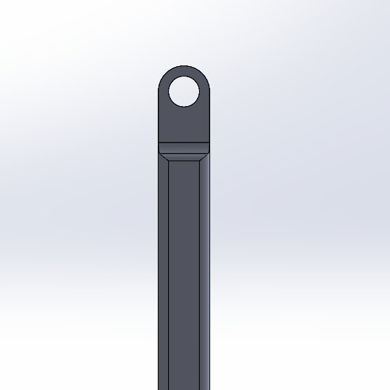
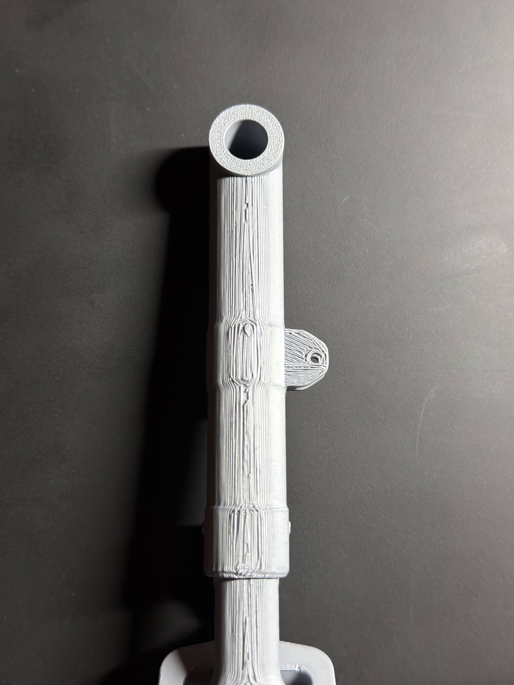

# Phase 3 – Prototyping, Testing & Reflection

## Fabrication Details

- Printer: Bambu Lab P1S  
- Material: PLA  
- Settings:  
  - Preset: 0.20 mm Standard (Bambu Studio)  
  - Supports: Tree supports  
- Scale:
  - Entire assembly scaled to 4.2% of original design  
  - Pins scaled further (ex: 60 mm → 50 mm → then scaled 4.2%)

- Reprints:
  - Wheels/Tires:
    - Originally hollow → poor print quality
    - Redesigned as solid → reprinted successfully

- Notes:
  - Supported regions had poor surface finish  
  - Small scale reduced print accuracy  

---

## Assembly Procedure

- Strut + torque link + pins printed as one piece  
- Bogie printed with pin pre-inserted (snap-fit into strut fork)  
- Wheels and tires printed together  
- Tires spray painted black  

---

## Assembly Challenges

- Tight tolerances did not scale well  
- Pins difficult to fit at small scale  
- Rough surfaces from supports affected fit  

---

## Testing Plan

- Checked:
  - Rotation of joints  
  - Fit between components  
  - General smoothness  

---

## Results

- Snap-fit worked for bogie connection  
- Rotation was functional but not perfectly smooth  
- Supported areas showed reduced quality  

---

## Comparison to Phase 2

- Expected:
  - Clean fits and smooth motion  
- Actual:
  - Tolerance issues and rough interfaces  
  - Reduced precision due to scaling  

---

## Failures & Mistakes

- Designed tolerances based on CAD, not printer capability  
- Scaling to 4.2% made tolerances too tight  
- Hollow wheel design failed → required redesign  
- Overuse of supports reduced surface quality  

### Link Failure (Retraction Link)

One of the critical failures occurred in the retraction link component (shown below).

<table>
  <tr>
    <td align="center">
       
      CAD Model
    </td>
    <td align="center">
       
      Printed Part
    </td>
  </tr>
</table>

- In the CAD model, the hole regions had sufficient surrounding material for strength
- However, after scaling to 4.2% and printing in PLA:
  - The effective wall thickness around the holes was significantly reduced
  - Layer-based printing introduced weak points around the circular geometry
- This resulted in a stress concentration at the hole
- The part failed at this location during handling/assembly and required reprinting

Root Cause:
- Geometry was not adjusted for small-scale manufacturing
- Printer resolution limits reduced effective material thickness
- Layer adhesion + circular hole geometry weakened the region further
---

### Poor Surface Quality / Stringing (Strut Component)

   
  Printed Strut (Surface Defects / Stringing)

The strut component exhibited noticeable surface defects and stringing, particularly along vertical faces.

- The print showed:
  - Stringing between features  
  - Uneven extrusion lines  
  - Rough surface finish  

- These defects were most prominent in:
  - Thin vertical sections  
  - Areas with frequent start/stop of extrusion  
  - Regions requiring support  

Root Cause:
- Small scale (4.2%) reduced feature resolution  
- Standard print settings were not optimized for fine features  
- Retraction and cooling were not ideal for this geometry  

Impact:
- Reduced surface quality  
- Potential reduction in strength  
- Poorer fit between components

## Improvements (Version 2)

- Increase tolerances for all mating parts  
- Reduce reliance on small pins  
- Design for fewer supports (better orientation)  
- Avoid hollow features at small scale  
- Consider larger scale or finer print settings  

---

## Key Takeaways

- CAD tolerances ≠ printable tolerances  
- Scaling down amplifies manufacturing limitations  
- Supports negatively affect surface finish  
